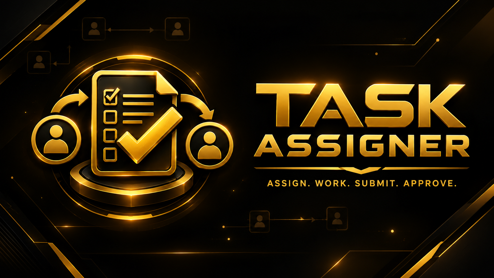
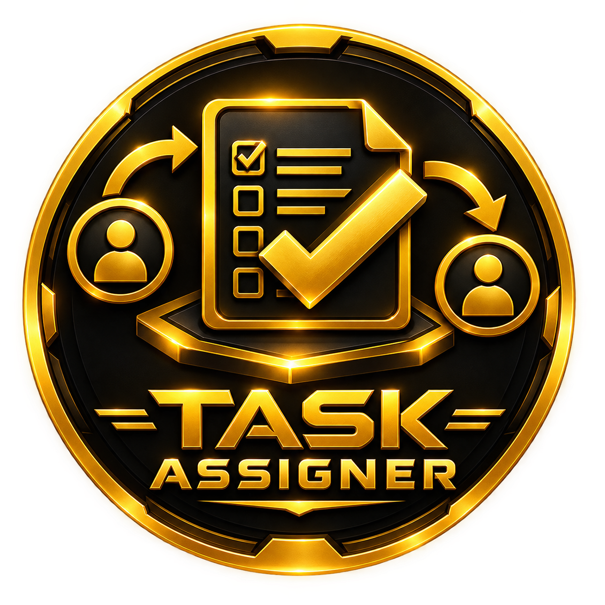
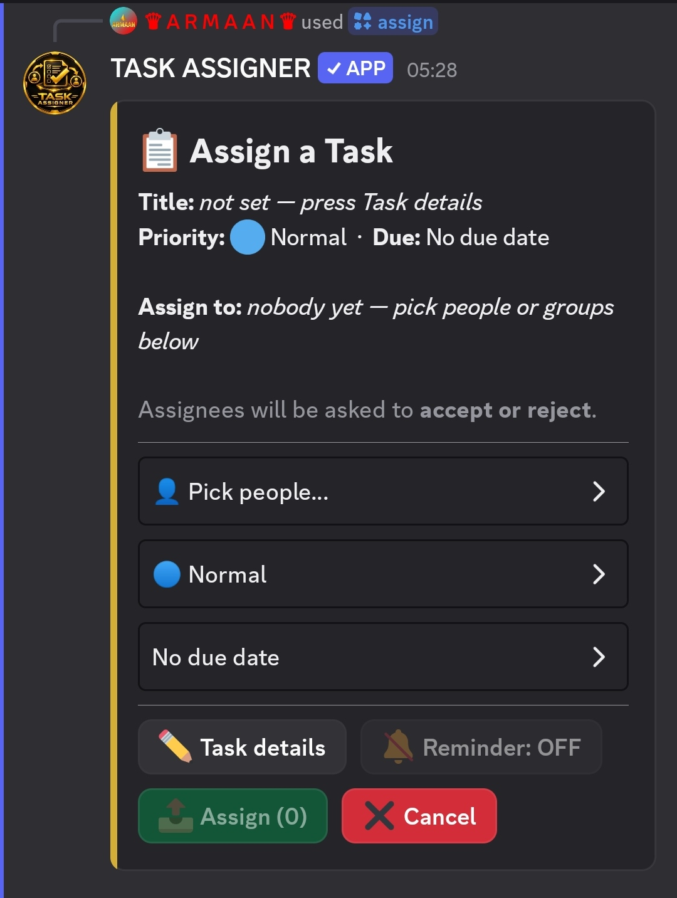
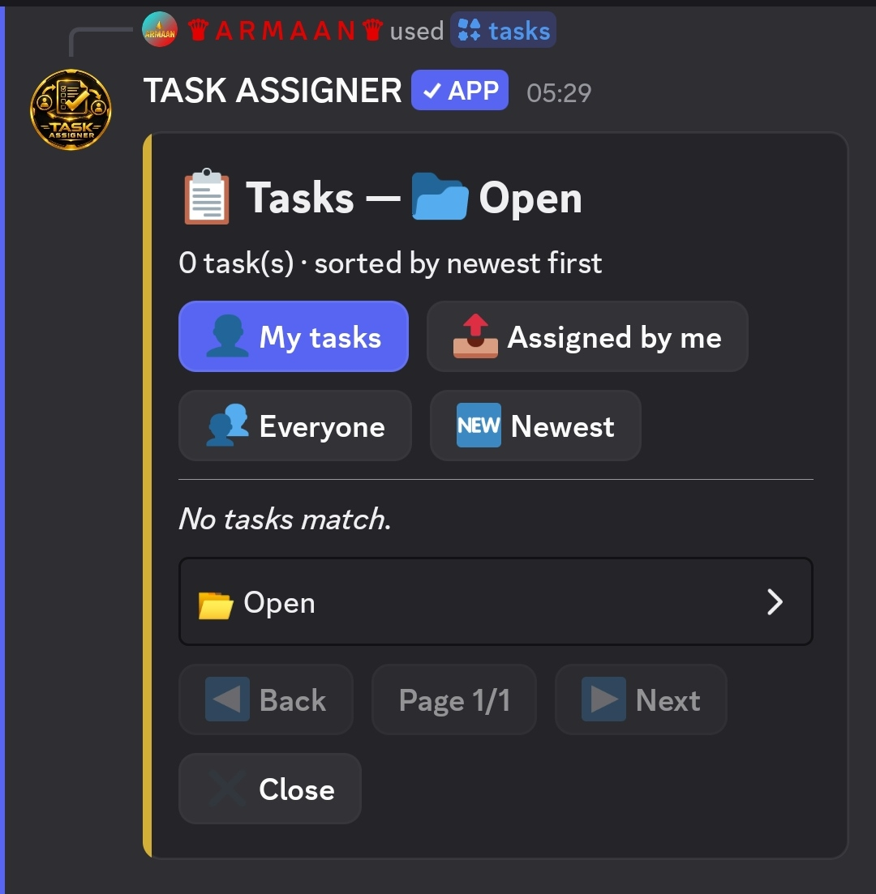
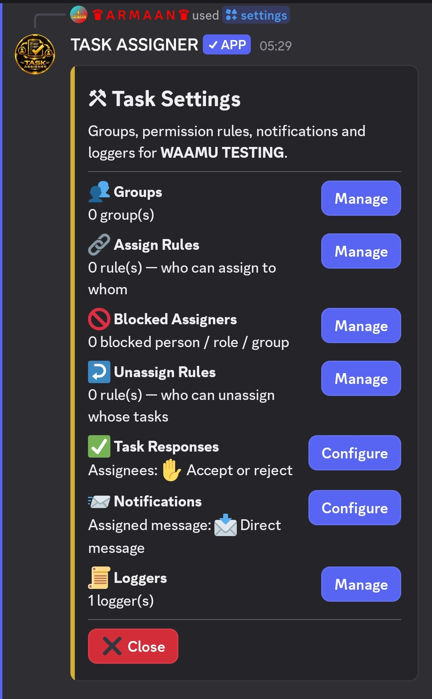
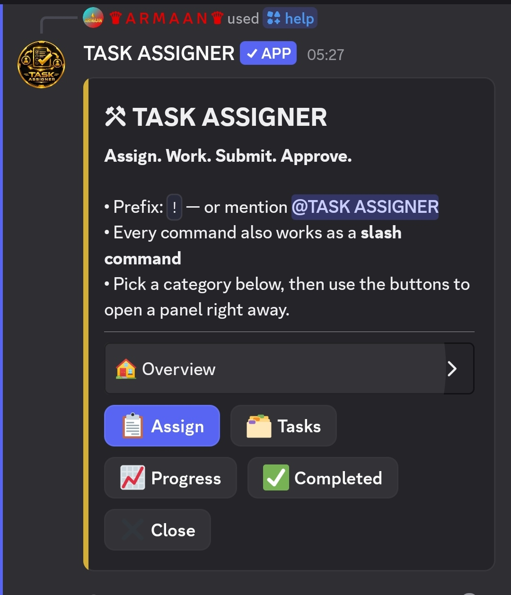

 

# 🟡 TASK ASSIGNER

### Assign • Track • Complete

**Simple, organized task management for Discord.**

 

---

## 🟡 What is Task Assigner?

**Task Assigner** is a Discord bot built to make assigning, organizing, tracking, and completing work easier.

Instead of losing responsibilities inside normal Discord messages, turn them into **clear, manageable tasks**.

> 📌 **Assign** work  
> 📊 **Track** progress  
> 🔔 **Monitor** updates  
> ✅ **Complete** tasks

---

## ✨ Features

<table>
<tr>
<td width="50%">

### 📌 Task Assignment

Assign work to people or whole groups, with a priority, a due date and a reminder. Assignees can accept or reject.

</td>
<td width="50%">

### 👥 Groups & Rules

Decide who can assign to whom. Build groups from people and roles, with exceptions on both sides.

</td>
</tr>

<tr>
<td width="50%">

### 📋 Task Browser

Page through tasks, filter by status, sort by newest or due soonest, then accept, update or complete.

</td>
<td width="50%">

### 📊 Progress Tracking

Report progress with notes, mark tasks complete and browse everything that's finished.

</td>
</tr>

<tr>
<td width="50%">

### 🔔 Due Reminders

A heads-up an hour before and a nudge when a task is due. Turn them on or off with one button.

</td>
<td width="50%">

### 😴 Custom Snooze

Snooze any reminder for exactly as long as you want: `30m`, `2h`, `1d 6h`, `1w`.

</td>
</tr>

<tr>
<td width="50%">

### 📝 Personal To-Do Lists

Unlimited-style lists with priorities, tags, notes, due dates, repeats, pins, subtasks and DM reminders.

</td>
<td width="50%">

### 📌 Staff & Group To-Do Lists

Staff can give a member or a whole group a to-do list, then see everyone's progress.

</td>
</tr>

<tr>
<td width="50%">

### 📜 Loggers

Send assigned, progress and completed logs to a channel, a person or a group.

</td>
<td width="50%">

### 🗳️ Vote Stats & Leaderboard

See how often you've voted this week, month, year or any custom period, and where you rank.

</td>
</tr>
</table>

---

## 📸 Preview

### 📌 Assigning Tasks

---

### 📋 Managing Tasks

---

### ⚙️ Server Settings

---

### ❓ Help & Commands

---

## 🎯 Built For

| 👥 Community | 🎯 Purpose |
|---|---|
| 🛡️ Staff Teams | Moderation, management tasks and staff to-do lists |
| 🎮 Gaming Communities | Gaming & server tasks |
| 💻 Development Teams | Development work |
| 📚 Study Groups | Assign study/project work |
| 🏢 Project Teams | Delegate responsibilities |
| 🌐 Discord Communities | Organize community work |
| 🏆 Competitive Teams | Manage team responsibilities |

---

## 💡 From Messages to Managed Tasks

### Without Task Assigner

> ❌ "Can someone handle this?"
>
> ❌ "Who was assigned to this?"
>
> ❌ "Is this finished yet?"

### With Task Assigner

> 🟡 **TASK ASSIGNER**
>
> 📌 Assign  
> 📊 Track  
> 🔔 Monitor  
> ✅ Complete

---

## 📋 Commands

Every command works as a slash command and as a prefix command. Use **`/help`** for the interactive help center.

| Command | What it does |
|---|---|
| `/assign` | Build a task and assign it |
| `/unassign` | Browse and unassign tasks |
| `/tasks` | Browse tasks with Back / Next |
| `/progress` | Report progress on a task |
| `/completed` | Completed history and marking complete |
| `/snooze` | Snooze a task reminder for any length of time |
| `/todo` | Your personal to-do lists |
| `/todoassign` | Give a member or group a to-do list |
| `/stafftodo` | See the lists you gave out and everyone's progress |
| `/todoremove` | Take back a list you gave out |
| `/vote` | Vote for the bot |
| `/votepos` | Your position on the vote leaderboard |
| `/voteinfo` | Votes this week, month, year or a custom period |
| `/voteleaderboard` | Top voters |
| `/settings` | Groups, assign rules and loggers (admins) |
| `/prefix` | Manage server prefixes (admins) |
| `/botinfo` | Bot stats and links |
| `/help` | Interactive help center |
| `/ping` | Latency |

---

## 🚀 Get Started

Ready to organize your Discord server?

### 🟡 Add Task Assigner

  

---

## ⭐ Support Task Assigner

If you like Task Assigner:

- ⭐ Star this repository
- 🤖 Invite the bot to your server
- 💬 Join the support server
- 🗳️ [Vote for Task Assigner on Top.gg](https://top.gg/bot/1555037991964246107/vote)

Every bit of support helps the project grow.

---

## 🔗 Official Links

| Resource | Link |
|---|---|
| 🤖 Discord Bot | [Invite Task Assigner](https://discord.com/oauth2/authorize?client_id=1555037991964246107) |
| 🌐 Website | [taskassigner.of.to](https://taskassigner.of.to/) |
| 💬 Support Server | [discord.gg/gpfgZS2Ca5](https://discord.gg/gpfgZS2Ca5) |
| ⭐ Top.gg | [top.gg/bot/1555037991964246107](https://top.gg/bot/1555037991964246107) |
| 🤖 Discord Bots | [discord.bots.gg](https://discord.bots.gg/bots/1555037991964246107) |

---

## 🛠️ About This Repository

This repository is the **official public showcase and information repository for Task Assigner**.

It is **not the bot's source-code repository**.

The purpose of this repository is to provide:

- 📚 Public information
- 📋 Feature documentation
- 📸 Screenshots and previews
- 📢 Project updates
- 🔗 Official links

---

# 🟡 TASK ASSIGNER

**Assign • Track • Complete**

*Turn responsibilities into action.*

 

[🌐 Website](https://taskassigner.of.to/) •
[💬 Support](https://discord.gg/gpfgZS2Ca5) •
[🤖 Invite](https://discord.com/oauth2/authorize?client_id=1555037991964246107)

